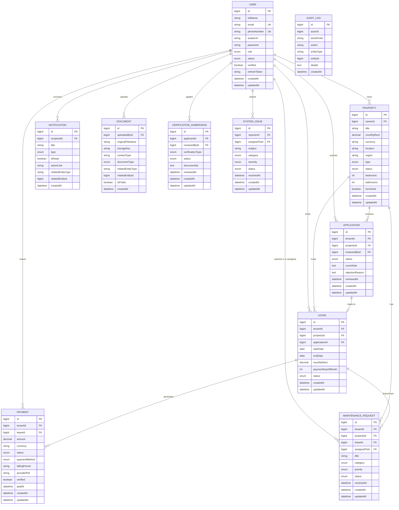

# Feature 0 — Cross-cutting concerns

Applies across all modules. Implement alongside Feature 1 (auth) and revisit when adding new domains.

## Goals

- Consistent error responses and validation messages
- Discoverable HTTP API (OpenAPI)
- Safe configuration (no secrets in VCS)
- Optional audit trail for sensitive admin actions
- Scheduling infrastructure for lease/payment reminders (used in Features 4-5, 7)

## Backend steps

1. **Global exception handling**  
   Extend `ControllerExceptionHandler` for new domain exceptions (e.g. `ResourceNotFound`, `ForbiddenOperation`). Return stable JSON shape matching existing `Message` / validation types.

2. **OpenAPI / Swagger**  
   Add `springdoc-openapi-starter-webmvc-ui` (or Boot 4-compatible equivalent). Configure JWT Bearer security scheme pointing to `Authorization: Bearer <token>`. Group APIs under `/api/v1`.

3. **Validation**  
   Keep DTOs with `@Valid`; add `@ControllerAdvice` consistency if needed. Document required fields in OpenAPI.

4. **Logging**  
   Use structured logs for auth failures and admin mutations. Avoid logging tokens or passwords.

5. **Audit (optional)**  
   Small `audit_log` table or append-only log for `userId`, `action`, `entityType`, `entityId`, `timestamp`.

6. **Scheduling**  
   Add `@EnableScheduling` on the main application class (or a dedicated `@Configuration`). Use `@Scheduled` jobs with dedicated service methods (Feature 4 / 7).

7. **Configuration**  
   Externalize secrets via environment variables or Spring Cloud config. Replace any committed credentials in local example properties with placeholders.

## Frontend steps

1. **API base URL**  
   `VITE_API_BASE_URL` (or equivalent) for dev/prod.

2. **Global error handling**  
   Map HTTP 401 to logout/refresh flow; 403 to toast + redirect; 422 to field errors if API returns them.

3. **No secrets in repo**  
   Document required `.env` keys in README (when you add one); never commit real keys.

## Acceptance criteria

- [ ] Swagger UI loads in dev and lists `/api/v1` endpoints with auth scheme
- [ ] All new controllers documented with summary + response codes
- [ ] Scheduling enabled before lease-notification tasks ship
- [ ] No plaintext production secrets in tracked config files

---

## Full entity relationship diagram



## Complete enum reference

| Enum | Values |
|------|--------|
| `Role` | TENANT, LANDLORD, CARETAKER, ADMIN, SUPER_ADMIN |
| `UserStatus` | ACTIVE, PENDING, SUSPENDED, DISABLED |
| `PropertyType` | APARTMENT, HOUSE, STUDIO, COMMERCIAL, LAND |
| `PropertyStatus` | DRAFT, AVAILABLE, RENTED, MAINTENANCE, ARCHIVED |
| `ApplicationStatus` | PENDING, APPROVED, REJECTED, WITHDRAWN |
| `LeaseStatus` | ACTIVE, EXPIRED, TERMINATED, PENDING_RENEWAL |
| `PaymentStatus` | PENDING, PROCESSING, SUCCEEDED, FAILED, REFUNDED |
| `PaymentMethod` | MPESA, TIGO_PESA, AIRTEL_MONEY, HALOPESA, BANK_TRANSFER, CASH, SIMULATED |
| `MaintenanceCategory` | PLUMBING, ELECTRICAL, STRUCTURAL, APPLIANCE, PEST, CLEANING, SECURITY, OTHER |
| `MaintenancePriority` | LOW, MEDIUM, HIGH, URGENT |
| `MaintenanceStatus` | SUBMITTED, UNDER_REVIEW, IN_PROGRESS, RESOLVED, CLOSED |
| `NotificationType` | APPLICATION, LEASE, PAYMENT, MAINTENANCE, SYSTEM, VERIFICATION |
| `DocumentType` | LEASE_AGREEMENT, NATIONAL_ID, PASSPORT, PROOF_OF_INCOME, PROPERTY_TITLE, INSPECTION_REPORT, PAYMENT_RECEIPT, MAINTENANCE_PHOTO, OTHER |
| `VerificationType` | IDENTITY, LANDLORD, CARETAKER |
| `VerificationStatus` | PENDING, APPROVED, REJECTED |
| `IssueSeverity` | LOW, MEDIUM, HIGH, CRITICAL |
| `IssueStatus` | OPEN, IN_PROGRESS, RESOLVED, CLOSED, DUPLICATE |
| `IssueCategory` | BUG, FEATURE_REQUEST, BILLING, ACCESS, PERFORMANCE, OTHER |

## Shared entity conventions

```java
// 1. IDENTITY PK (auto-increment, Long)
@Id @GeneratedValue(strategy = GenerationType.IDENTITY)
@Column(name = "ID")
private Long id;

// 2. Enums always stored as String for readability in DB
@Enumerated(EnumType.STRING)

// 3. All FK associations: LAZY fetch (prevent N+1 by default)
@ManyToOne(fetch = FetchType.LAZY)

// 4. Timestamps managed by Hibernate annotations
@CreationTimestamp   // CREATED_AT -- set on insert, never changed
@UpdateTimestamp     // UPDATED_AT -- refreshed on every save

// 5. Text fields longer than 255 characters
@Column(columnDefinition = "TEXT")

// 6. Monetary values
@Column(precision = 15, scale = 2)
private BigDecimal amount;
```

## Optional audit log entity

```java
// models/AuditLog.java -- append-only, never updated
@Entity
@Table(name = "AUDIT_LOGS",
       indexes = @Index(name = "idx_audit_actor", columnList = "ACTOR_ID, CREATED_AT"))
@Data @Builder @NoArgsConstructor @AllArgsConstructor
public class AuditLog {

    @Id @GeneratedValue(strategy = GenerationType.IDENTITY)
    @Column(name = "ID")
    private Long id;

    @Column(name = "ACTOR_ID")
    private Long actorId;

    @Column(name = "ACTOR_EMAIL")
    private String actorEmail;

    // e.g. "USER_ROLE_CHANGED", "LEASE_TERMINATED", "VERIFICATION_APPROVED"
    @Column(name = "ACTION", nullable = false)
    private String action;

    @Column(name = "ENTITY_TYPE")
    private String entityType;   // "User", "Lease", etc.

    @Column(name = "ENTITY_ID")
    private Long entityId;

    // JSON: { "before": {...}, "after": {...} }
    @Column(name = "DETAILS", columnDefinition = "TEXT")
    private String details;

    @CreationTimestamp
    @Column(name = "CREATED_AT", updatable = false)
    private LocalDateTime createdAt;
}
```

## Testing benchmark

Cross-cutting checks apply whenever the stack changes; use as a **release gate** before full regression of F1–F12.

| ID | Area | What to verify | Pass criteria |
|----|------|----------------|---------------|
| X0-01 | Swagger | Open `/swagger-ui` (or configured path) | All `/api/v1` routes listed; Bearer auth available; try authorize + call `/profile` |
| X0-02 | Error shape | Provoke 404 / 400 / 403 on known endpoints | JSON body matches project convention; no stack trace in prod build |
| X0-03 | Validation | POST invalid body to any `@Valid` endpoint | 400; field errors if designed |
| X0-04 | CORS | FE origin vs API | Browser preflight succeeds for authenticated calls |
| X0-05 | Scheduler | `@EnableScheduling` active | Logs show job firing in dev; no duplicate overlapping runs (idempotency) |
| X0-06 | Secrets | Repo scan / env in staging | No live passwords in tracked files |
| X0-07 | Audit log | Perform admin action (if enabled) | New `AUDIT_LOGS` row with actor + action |
| X0-FE-01 | API base URL | Wrong `VITE_API_BASE_URL` | FE shows clear network error, not blank screen |
| X0-FE-02 | Global 401 | Invalidate token | User directed to login; no infinite retry loop |

**Order of execution:** X0-01 → X0-04 first on new environments; then feature suites F1 → F12 in dependency order.

## References

- Backend: `exceptions/ControllerExceptionHandler.java`, `example.application.properties`
- Spec: `pms_implementation_plan.txt` -- "Cross-cutting concerns" section
