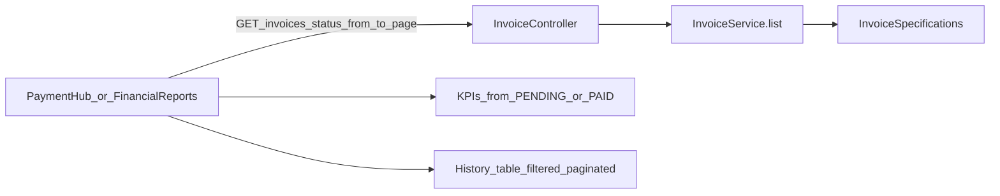

# Feature — Invoice audit history (show all statuses)

Show full invoice history (PENDING, PAID, CANCELLED) on tenant Payment Hub and landlord Finances for auditing, while keeping balance-due KPIs and pay/mark-paid actions scoped to PENDING only.

Also ship a small **pagination + due-date range** enhancement on `GET /api/v1/invoices` so history lists stay usable as volume grows.

## Decisions (locked)

- **Statuses in history:** `PENDING`, `PAID`, and `CANCELLED` (full audit trail).
- **Default view:** show **All** invoices.
- **Optional status filter:** All / Pending / Paid / Cancelled (same idea as maintenance queue filters).
- **KPI / actions stay PENDING-only:** balance due, Pay, Mark paid only for `PENDING`.
- **PDF list export:** match the current UI filter (All = omit `status` query param; include `from`/`to` when set).
- **List API:** returns `{ page, records }` (same pagination envelope as properties). Omit `page`/`size` for a soft-capped unpaged window (analytics / KPIs).

---

## What this means (simple terms)

Today, after an invoice is paid it **disappears** from the main tenant Payments and landlord Finances tables because those screens only fetch/display `PENDING` invoices.

You want an **audit history**: tenants and landlords can still see paid (and cancelled) invoices later — while still paying / marking paid only for outstanding bills.

---

## Current behavior (gaps)

| Surface | What it loads today | Gap |
|---------|---------------------|-----|
| Tenant [`PaymentHub.tsx`](../../src/pages/tenant/PaymentHub.tsx) | `useInvoices({ status: 'PENDING' })` only | Paid invoices never appear in the list |
| Landlord [`FinancialReports.tsx`](../../src/pages/owner/FinancialReports.tsx) | KPI/chart use paid; main table is **“All pending invoices”** only | No full history table for audit |
| Tenant application billing section | All invoices for contract (unfiltered API) | Already closer to “all”; keep consistent |
| Tenant overview | Separate pending + paid for KPIs / recent payments | Fine as-is (summary widgets, not the audit list) |

---

## Backend changes

`GET /api/v1/invoices`:

| Param | Purpose |
|-------|---------|
| `status` | Optional status filter |
| `leaseContractId` | Optional contract scope |
| `from` / `to` | Optional due-date range (`LocalDate`) |
| `page` / `size` | 1-based pagination (omit both → soft unpaged window, max 5000) |
| `sortBy` / `sortDirection` | Sort (default `dueDate` when paging) |

Response: `{ page: { pageNo, pageSize, totalSize, pageCount }, records: [...] }`.

Implementation: `InvoiceRepository` + `JpaSpecificationExecutor`, `InvoiceSpecifications.scopedList(...)`, `InvoiceService.list(...)` → `Page<InvoiceResponse>`.

---

## Frontend implementation steps

### 1. Shared status filter + pagination

- `components/invoices/InvoiceStatusFilter.tsx`
- `components/invoices/InvoiceListPagination.tsx`
- Schema/API: `InvoicePageSchema`, `from`/`to`/`page`/`size` on `InvoiceListFilters`
- `useInvoicePage` / `useInvoices` (records via `select`)

### 2. Tenant Payment Hub

1. PENDING-only query for balance / next due / pay CTA.
2. Paginated history with status + due-date filters.
3. Pay only when `PENDING` + `MOBILE`; Download PDF for all.
4. Export PDF passes current filter (status + dates).

### 3. Landlord Financial Reports

1. PENDING / PAID unpaged queries for KPIs + chart (lease filter preserved).
2. History section: status + date range + pagination; Mark paid only for `PENDING`.
3. Export invoices PDF matches UI filter.

### 4. Consistency polish (light)

- Do **not** change Tenant Overview KPI widgets (balance = pending; recent payments = paid).

### 5. i18n

Add `invoices.*` keys (en/sw): history title, filter labels, empty states, pagination.

---

## Data flow (after)

---

## Implementation order

1. Backend list pagination + date range
2. Frontend schema / API / queries + filter + pagination UI
3. Payment Hub + Financial Reports
4. Align PDF export with filter; smoke tenant + landlord

---

## Acceptance criteria

- [ ] After paying / marking paid, invoice **remains visible** with status `PAID`
- [ ] Filter can narrow to Pending / Paid / Cancelled / All
- [ ] Due-date range and pagination work on history lists
- [ ] Balance due and pay/mark-paid only apply to pending invoices
- [ ] `GET /invoices` returns paginated `{ page, records }`; role scoping unchanged
- [ ] PDF list export matches the visible filter (status + dates)

## Out of scope

- New backend report endpoints
- Changing Tenant Overview summary cards
- Admin invoice audit UI
