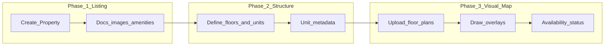

# Feature 2 — Property onboarding + structure + Visual Map

End-to-end flow for landlords/property managers: **create a property listing → define floors and units → configure the visual floor map** (image + overlays). This document is aligned with the **current backend and webapp**, not the legacy sketch that assumed enum `PropertyType`, `monthlyRent` on `Property`, etc.

## Related plans (read first)

| Plan | Purpose |
|------|---------|
| [pre_visual_map_feature.plan.md](./pre_visual_map_feature.plan.md) | Auth, RBAC, API client, public `/floors/{id}/map` vs `/admin/**` |
| [visual_map_feature.plan.md](./visual_map_feature.plan.md) | Visual Map V2 (floor plans, overlays, owner/admin APIs, webapp hooks) |
| Backend module note | `/home/lynx/Desktop/property-management/src/main/java/dev/hud/PropertyManagementSystem/visualmap/README.md` |

## Product flow (owner)



- **Phase 3** is largely **implemented** (requires existing `floorId` / `FloorUnit` rows).
- **Phase 2 (backend)** is **implemented**: `PropertyStructureOwnerController` under `/api/v1/owner/properties/{propertyId}/…` (floors CRUD, bulk units, unit PATCH). **Webapp wizard / floor picker** is still **planned**.
- **Phase 1** is largely **done** on the backend (JWT ownership on create, detail/PATCH/DELETE, amenities/gallery/ownership docs on `Property`); marketplace UX remains separate work (see gap table).

## Domain as implemented (Option B)

**One `Property` = one building root** for the visual map (no separate `Building` entity today).

```
Property (PROPERTY)
 └── Floor (FLOOR)
      ├── FloorPlan (FLOOR_PLAN) — 1:1, image + dimensions
      └── FloorUnit (FLOOR_UNIT) — units; monthly rent & bedrooms here
            └── UnitOverlay (UNIT_OVERLAY) — 1:1, x/y/w/h %
```

**Important:** **`Property` does not carry monthly rent.** Rent is on **`FloorUnit.monthlyRent`** (`/home/lynx/Desktop/property-management/src/main/java/dev/hud/PropertyManagementSystem/models/property/FloorUnit.java`). Property **type** uses a **catalog** (`PropertyType` entity + `propertyTypeId` / `propertyTypeName` on `Property`), not the enum block from older docs.

**`PropertyStatus`** (`DRAFT`, `AVAILABLE`, `RENTED`, `MAINTENANCE`, `ARCHIVED`) applies to the listing. **`FloorUnitStatus`** (`AVAILABLE`, `OCCUPIED`) drives map clickability on the public floor map.

## Endpoint matrix

### A. Listing — `/api/v1/properties` (partially done)

| Method | Path | Auth / notes | Status |
|--------|------|----------------|--------|
| GET | `/api/v1/properties` | Authenticated | **Done** — paginated list → `PropertyResponse` |
| POST | `/api/v1/properties` | `LAND_LORD` | **Done** — owner from JWT; optional amenities/gallery/docs on `PropertyRequest` |
| GET | `/api/v1/properties/{id}` | Authenticated | **Done** — `PropertyDetailResponse` (ownership docs masked unless owner/admin) |
| PATCH | `/api/v1/properties/{id}` | Owner / Admin | **Done** — `PropertyPatchRequest` |
| DELETE | `/api/v1/properties/{id}` | Owner / Admin | **Done** — soft-delete (`deleted = true`) |

Filters (`location`, `minRent`, `status`, …) depend on listing/product rules once detail and marketplace contracts exist.

### B. Structure (owner) — `/api/v1/owner/properties/...` (**backend done**)

Implemented by `PropertyStructureOwnerController` + `PropertyStructureService`. JWT **`LAND_LORD`** or **`ADMIN`/`SUPER_ADMIN`** at controller level; mutating/list paths still require **owner or admin** in the service layer (`Property.owner`).

| Method | Path | Purpose |
|--------|------|---------|
| GET | `/owner/properties/{propertyId}/floors` | List floors (+ unit counts) |
| GET | `/owner/properties/{propertyId}/floors/{floorId}/units` | List units |
| POST | `/owner/properties/{propertyId}/floors` | Create floor (`label`, `sortOrder`) |
| PATCH | `/owner/properties/{propertyId}/floors/{floorId}` | Partial update floor |
| DELETE | `/owner/properties/{propertyId}/floors/{floorId}` | Delete floor (drops stored floor-plan file; cascades units/overlays) |
| POST | `/owner/properties/{propertyId}/floors/{floorId}/units` | Bulk create units |
| PATCH | `/owner/properties/{propertyId}/units/{unitId}` | Update unit metadata |

Deleting a floor removes **`FloorPlan`** and its image via **`FloorPlanStorageService`** before removing **`Floor`**.

### C. Visual map (existing)

| Method | Path | Audience |
|--------|------|----------|
| GET | `/api/v1/floors/{floorId}/map` | **Public** |
| POST | `/api/v1/owner/floors/{floorId}/plan` | Owner — multipart plan |
| PUT | `/api/v1/owner/floors/units/{unitId}/overlay` | Owner |
| PATCH | `/api/v1/owner/floors/units/{unitId}/status` | Owner |
| POST/PUT/PATCH | `/api/v1/admin/floors/...` | Admin override |

See `FloorMapPublicController`, `FloorMapOwnerController`, `FloorMapAdminController` under  
`/home/lynx/Desktop/property-management/src/main/java/dev/hud/PropertyManagementSystem/controllers/visualmap/`.

### D. Marketplace / tenant (future)

- Public or scoped **GET** listings and **GET** property detail (policy + field masking).
- Webapp: replace hardcoded data in `src/pages/MarketPlace.tsx`, `src/pages/PropertyDetail.tsx`; deep-link to `/floors/:floorId/map`.

## Gap analysis (requirements vs code)

| Requirement | Status |
|-------------|--------|
| Property name, type, address/location | **Partial** — title, catalog type id/name, location + region/district/ward ids |
| Ownership documents | **Backend done** — `PropertyOwnershipDocument` + PATCH/detail masking rules |
| Property-level gallery images | **Backend done** — `PropertyGalleryImage` paths |
| Amenities | **Backend done** — `PROPERTY_AMENITY` element collection |
| Number of buildings | **Ambiguous** — Option B = one building per property unless we add `Building` or multiple listings |
| Floors count / floor definitions | **Backend done** — owner structure APIs (`GET`/`POST`/`PATCH`/`DELETE` floors) |
| Units per floor + number, rent, bedrooms, availability | **Backend done** — bulk create + PATCH unit; **`FloorUnitType`** on unit + public map **`unitType`** field |
| Visual layout | **Done** once floors/units exist and overlays uploaded |
| Marketplace | **Not done** for UX (`MarketPlace.tsx`, etc.); **API layer** for listings exists (`propertyApi` + `property.queries.ts`). |

## Backend implementation roadmap (concise)

1. ~~**PropertyService**~~ — shipped (JWT owner, detail/PATCH/DELETE, amenities/gallery/docs).
2. ~~**PropertyStructureOwnerController + service**~~ — shipped under `/owner/properties/{propertyId}/…`.
3. ~~**Unit type**~~ — `FloorUnitType` on `FloorUnit`; exposed via `UnitMapUnitDto` / structure responses (webapp contract updated).
4. **Tests** — integration coverage for structure ownership + public map unchanged.

## Frontend implementation roadmap (concise)

1. ~~Align **`property.schema.ts`** / **`property.queries.ts`** + **`propertyStructure` schemas/API/queries**~~ — wired to backend (`src/api/propertyApi.ts`, `src/api/propertyStructureApi.ts`).
2. **Onboarding wizard** — listing → structure → navigate to owner visual map **with floor picker** (replace manual floor id entry in `src/pages/owner/VisualMapOwner.tsx`).
3. **Inventory / marketplace** — consume hooks in pages (`MarketPlace.tsx`, `PropertyInventory.tsx`, `PropertyDetail.tsx`).

## Acceptance criteria

- [ ] Owner creates a property with **ownership from JWT**, not spoofable client user id.
- [ ] Owner defines **floors and units via API** without manually typing opaque database ids for normal UX.
- [ ] Owner completes **visual map** per floor using existing upload/overlay/status flows.
- [ ] Optional: tenants browse listings and open floor maps for available units.
- [ ] Optional: documents/images/amenities stored and served per security policy.

## Non-goals (unless product expands scope)

- Separate **`Building`** aggregate under one listing (defer multi-building modeling).
- Reintroducing **single `monthlyRent` on `Property`** as source of truth (use units or derived aggregates).

## Testing benchmark (updated emphasis)

| ID | Scenario | Expected |
|----|----------|----------|
| F2-01 | Create property | Authenticated landlord; `owner_id` matches JWT subject |
| F2-02 | Structure APIs | Owner can CRUD floors/units only for owned `propertyId`; others 403 |
| F2-03 | Visual map | Unchanged public map; owner/admin mutations still gated |
| F2-04 | Marketplace | List/detail + filters once implemented |
| F2-FE-01 | Wizard | Listing → structure → visual map without raw floor id |

## Code references (webapp)

- `src/schemas/property.schema.ts`, `src/schemas/propertyStructure.schema.ts`
- `src/api/propertyApi.ts`, `src/api/propertyStructureApi.ts`
- `src/queries/property.queries.ts`, `src/queries/propertyStructure.queries.ts`
- `src/pages/MarketPlace.tsx`, `src/pages/PropertyDetail.tsx`, `src/pages/owner/PropertyInventory.tsx`
- `src/pages/owner/VisualMapOwner.tsx`, `src/api/floorMapApi.ts`, `src/hooks/useFloorMap.ts`
